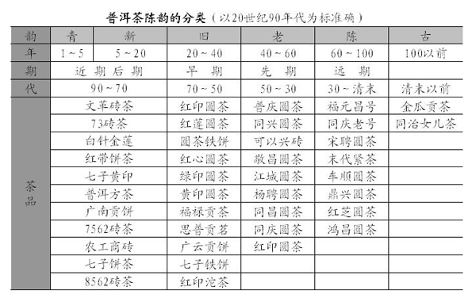

# 《普洱茶》品茗篇
### 邓时海(台湾师范大学教授、中国普洱茶学会会长、杨式太极拳第六代传人)
---
[返回首页](index.html)

### 普洱茶的真性

不熟不霉是为真普洱。要想进入普洱茶的品茗艺境，首先必须知道什么是“真性普洱”。本来在艺术境界中，无所谓真与假，只是出自直觉而感性的情怀。然而，这种感性情怀，必须是建立在一个共同基础上，这个共同基础的标准就是真。真，其性也，物之真实性。求普洱茶的真，其先决条件必须是好的普洱茶菁。自古以来出自六大茶菁为优良茶品，而且以易武茶山乔木最胜。其次勐海、凤山、勐库、思普、江城、勐弄等茶区，都有好的普洱茶品。有了良发好普洱茶菁，要求得普洱茶真性，可以从两方面去认知，一是普洱茶的生，也就是其制造过程；二是普洱茶的长，也就是其陈化过程。能够保有真性的普洱茶品，就是好普洱茶！

### 普洱茶的新鲜

（一）真普洱的生，其制作工序必须是新鲜

普洱茶的成型过程，也就是制作工序，必须保持新鲜，越是新鲜的食物，越能表现它的真性，是食物加工最基本的理念。普洱茶在制作工序上，也必须要求能保持新鲜，以得到它的真性。

新鲜是从生茶青饼（依传统说法，未经过发酵工序的叫生茶，生茶茶菁的普洱茶为青饼）得来，普洱茶是否新鲜，首先要看是否是以生茶方式制作。在近期（1970年）以前的普洱茶制作，都以生茶工序处理，将采来的茶菁经过萎凋、揉捻、晒干、蒸压成型而加以干燥，完成制造工作后，叫青饼普洱茶。由生茶制作工序所生产的普洱茶，才能保持最新鲜。在老的产品中，偶尔也曾出现熟茶的茶品，那只是属于失败的工序。

打从近期开始，出现了大量的普洱茶熟茶。1973年昆明茶厂研究成功潮水渥堆发酵“快速陈化”，也就是普洱熟茶制造方法。这些熟茶在制作过程中，于蒸压工序前，将晒干的毛茶加水渥堆，促成高度发酵。根据资料显示，一百千克行茶加进四十千克水，堆积在室内三四天或一星期之久，使茶叶转为褐色，“粗青气退减”。最后发酵好的毛茶再加工蒸压成普洱型茶。普洱熟茶在经过重而全发酵过程，已经失去了真性，比如做成的豆腐乳，远离了豆腐的原始真性了。熟茶因经过渥堆发酵，而精青气褪减的变化，正是失去普洱茶真性的关健所在，也就是失去了新鲜的品味。只有生茶青饼普洱才能保有最新鲜品味，也就是最能保有普洱茶的真性。

（二）如何品出新鲜普洱

要品出新鲜的普洱茶，必须先能辨别生茶和熟茶。普洱生茶和熟茶的辨别，可以从香气、汤色和叶底来找到答案。

1、从香气辨别

普洱熟茶因为经过渥堆，会产生一般“熟味”一般称为“普香”。一般只有十年陈期以内的干仓熟茶（依传统说法，未曾霉变过的茶品为干仓茶），可以从型茶表面闻到一股熟茶味。约在十年至二十年左右，那股表面熟茶味已经消失，则可从茶汤中感觉出有一股“梅子香”，接着有“枣香”或“参香”，最后变成“沉香”。

1973年间由紧茶的材料改做成的第一批熟砖茶，称之为“73厚砖茶”，到今已有三十多年了，无论从型号茶或茶汤，都没有熟味感觉，却有一股“沉香”。沉香是由熟味，经过长期干仓陈化最后转变过来最好的熟茶茶香。普香、梅子香、枣香、参香或沉香是最直接而有效分辨生茶和熟茶的方法之一。

2、从汤色辨别
干仓的普洱生茶茶汤是栗红色，接近重火乌龙茶汤色，即使陈年的生茶，比如已经有八九十年历史的龙马牌同庆老号普洱茶，它的茶汤颜色只略比五十年的红印普洱圆茶的茶汤深一些。而熟茶的茶汤颜色是暗栗色，甚至接近黑色。所以在现代的茶种分类中，将普洱茶列为黑茶类，是和普洱熟茶的汤色有关的。

3、从叶底辨别

干仓的普洱生茶叶底呈现栗色至深栗色，与台湾的东方美人茶叶底颜色很相似。叶条质地饱满柔软，充满新鲜感。一泡同庆老号普洱茶的叶底，可以显现出百年那种新鲜活力。普洱熟茶的叶底多半呈现暗栗或黑色，叶条质地干瘦老硬。如果是发酵比较重的，会有明显炭化，像被烈火烧烤过。有些较老的叶子，叶面破裂，叶脉一根根分离开，有如将干叶子长期泡在水中那种碎烂的样子。但是，有些熟茶若渥堆时间不长，发酵程度不重，叶底也会非常接近生茶叶底。反之，也有些生茶在制作工序中，譬如茶菁揉捻后，无法立即干燥，延误了较长时间，叶底也会呈深褐色，汤色也会比效浓而暗，跟只是轻度发酵渥堆过的熟茶是一样的。

早期有些茶庄，如勐景茶庄、鼎兴茶庄所生产的紧茶，其中有的是熟茶，就是因为在生茶工序中，延误了时间而形成熟的紧茶。这些轻度发酵的普洱生茶，经过较长时间的存放，熟味已消失而回归到极似普洱生茶的品味，但是普洱生茶原有那种新鲜感，已受到一定程度的损害了。

### 普洱茶的自然
* 真普洱的长，其生命历程必须是自然

普洱茶的生命历程，这里是就狭义而言，指普洱茶成型后开始，那段漫长的陈化过程。普洱茶与其他许多茶类不同的是，它必须要有一段储存的历史过程。自然走过的历史，才能表露其真实性。

能够认知而鉴别普洱茶的生与长，才有足够的能力，随心所欲地去品尝普洱茶。虽然各人所拥有的感性情怀不同，但普洱茶的真性却只有一个。比方我们观看红色时，由于各人生理上的差异，而对红色的感受有所不同，却都有这是红色的共识。我们的视觉、味觉和嗅觉标准，虽然有着很大的差异，也影响了对普洱茶的感受，然而大家已经能从普洱茶得到一个稳定而真实的自我标准，也就应该有了品评普洱茶的条件和能力了。

* 自然，从干仓陈放得来

普洱茶是生长在中国云南省，那里是属于大叶茶种，茶叶大而肥厚，所含的成分最为浓烈。所有在云南制造出来的青生普洱茶，因为茶性太过浓烈，有如野生茶种一样，无法马上饮用，必须要储放多年促成后发酵，等到茶性转化温顺后才能冲泡饮用，所以储存陈化的工序技术，也就成为普洱茶的生命历程的一部分。

有关普洱茶后发酵过程所产生的特色，是以后发酵来发挥其茶性，增加其品茗价值感。普洱茶的后发酵过程又分为干仓与湿仓，更形成普洱茶的品味多变且趣味丰富。如果只是站在喜欢的立场，以是否好喝的角度着眼，根本不必谈生茶、熟茶，或者干仓湿仓的问题，只要对上了各人的口味，只要喝了感觉舒服，便是好茶。但是，如果论及品茗意境，那就必以得到普洱茶的真性为标准，且必须以生茶中的干仓普洱茶为唯一的选择了！

在学理上，普洱茶后发酵的化学作用，就是茶叶内部多酚类化合物的氧化作用。这种氧化过程，会有三种作用情况：一是自动氧化作用；二是酶性氧化作用；三是曲菌氧化作用。虽然这三种氧化的功效，会破坏多酚类化合物，使滋味变淡，色泽转暗，但是这三种氧化作用过程是直接影响普洱茶的陈化速度、茶型外观以及色泽品味的主要因素。在陈化历程中，氧化过程最慢的是自动氧化作用；其次为酶性氧化作用；氧化过程最快速的，是曲菌氧化作用。根据初步了解，普洱茶后发酵情形只有两种：一是自动氧化和酶性氧化作用，两者混合进行；另一是自动、酶性及曲菌氧化作用，三者混合进行。前者后发酵过程我们叫它为“干仓”后发酵；后者的后发酵过程，称为“湿仓”后发酵。根据一般知识，空气中的相对湿度在百分之八十以上者，容易造成曲菌的生长。这种会促进产生曲菌的环境，我们就叫它为“湿仓”；相反的，如果因为空气过于干燥，曲菌无法产生的环境，称它为干仓。湿仓后发酵就是有曲菌氧化的后发酵，所以湿仓后发酵能促进普洱茶快速的陈化。

干仓后发酵的自动氧化和酶性氧化，属普洱茶内部成分的变化。但茶叶经高温蒸过或储放了一段时间以后，酵素会失去催化功能，所以大部分的普洱茶干仓后发酵，只是自动氧化过程。湿仓后发酵，除了干仓后发酵的作用外，增加了外在曲菌氧化作用。曲菌的催促氧化，是曲菌寄生在茶叶上，对茶叶纤维的破坏性很强，因而破坏了茶叶的组织，并且也会留下霉菌的残留物，影响茶叶成分极大。湿仓的后发酵已经大大破坏及改变了茶叶原有的本质，干仓的后发酵，对普洱茶本质真性的保存就理想多了。所以干仓储放最适合普洱茶陈化的需要，是属于自然陈化过程。

干仓后发酵，也称之为自然陈化普洱茶。湿仓后发酵，通常称之为霉变陈化普洱茶。形成湿仓茶的主要原因，是一些商人为了使新鲜的普洱生茶能及早饮用，而立即销售获利。一般在市面上看到的湿仓茶，绝大多数是由生茶形成的，极少看到有熟茶的湿仓茶。所以做成熟茶的原因，也就是为了能够提前饮用，马上出售，与湿仓茶的目的相同。近来有一些普洱茶品，是做成轻度发酵熟茶，而后再加以湿仓陈化，其茶性的确比较接近真性特色。

* 如何品出干仓普洱

分辨干仓与湿仓普洱茶的方法，可以从外型、气味、汤色和叶底看出来。

1.从外型辨别

干仓普洱茶的条索结实、颜色鲜润、油面光泽，充分表现了茶叶的活力感；湿仓普洱茶的条索松脱、颜色暗淡、粗糙黑绿且茶叶表面或夹层留有绿霉。20世纪50年代的圆茶铁饼（圆铁），本来都制成生茶出厂，因为时采用改良的金属压模，做出型太过结实，不利于快速陈化。有些商人便将它以湿仓处理，以利近期销售。

2.从气味上辨别

一般正在发霉不久的，或发了霉又加密封，一打开时，就从茶品中发出一股霉味。如果发霉很久了，如一饼95年红大益7542青饼于十年前霉变过，后移到干仓，则饼型本身已经闻不出霉味来，但在茶汤中仍然有一股扑鼻的霉味。如果发霉超过二十年以上，茶汤中的霉味会较弱，甚至闻不太出来，但茶汤入口，入喉后，口腔内会有针刺的感觉，喉头有被锁住，甚至发干，口水难咽的感觉。

3.从汤色辨别

干仓生茶的汤色是栗红色，陈期在三四十年以上的，略转深栗色。如干仓存放的60下关铁饼，茶汤呈鲜栗红色，是典型的干仓老生普的汤色；而50年代五八广云贡饼，汤色却截然不同，历经了50多年岁月的洗礼，按理说汤色也是越来越红浓明亮才是，然而它却不同，并不张扬的外表，外行人看了应该不会有品饮它的欲望，可往往看物不能只观其外表。五八广云外观茶青似黄叶片，饼型比70广云、80广云、90广云偏大，且茶饼反面的凹洞尤其小。开汤后，闻其香，令人闻香生津，茶汤似陈年黄酒，令人匪夷所思。悠悠的茶香，淡淡的茶色，厚厚的茶汤，悠长的茶气，迷人的茶韵，茶汤冲达一二十次，无不让人惊叹普洱之魅力。而湿仓茶的茶汤，像熟茶一样呈暗栗色，甚至变成黑色。

4.从叶底辨别

干仓普洱茶的叶底是栗黄色至深栗色，质地活性柔软，其生茶的叶底，在干仓长期陈化过程中，颜色变化不大。我们常常称赞近百年的同庆老号普洱茶，将当年的活力泡出来，主要也是赞赏它的叶底呈现出新鲜栗色，使人感觉有如新鲜东方美人的叶底，将我们的情怀带回百年前易武大茶山那种心旷神怡。湿仓普洱茶的叶底，是暗栗色或是黑色。湿仓生茶和熟茶的叶底颜色很相似，但熟茶叶底是干硬的，而湿仓生茶的叶底质地则保持柔软，且富于弹性。

新鲜自然是好普洱茶的基本条件，只有在这个基本条件之下，才能找到普洱茶的真实性，惟有找到普洱茶的真性，才可能品出它的意境。同样的，了解其真性的存在，才会致力于制作普洱生茶，并致力于以漫长岁月缓慢地陈化，形成普洱茶最宝贵的伦理文化，所谓“祖父做茶孙子卖”的良性循环。惟有保持有真的陈年普洱茶，才能让世世代代享受到纯正自然健康的普洱茶。而健康普洱茶才能让人喝出健康来。

因此，品老茶，存新茶，是爱茶人士的最佳选择。老茶价高，数量少，新茶价低，易存耐放，存放妥当，即可存放出品质优良的无上佳品。

### 普洱茶的陈韵
从客观的角度，真就是美。凡事与物的真实性，就是它的最美。然而，人是生活在感情世界里，参与情感而引起了主观，所以对审美的能力，往往是落在客观的真性和主观的感情之间，取得一个平衡点上。由于这个道理，真实性虽不一定就是美，但美必定在真这决策机构的前题下所产生。构成普洱茶的美，同样是客观的真性和主观的感性交会而成。前文曾对普洱茶的真实性，就是从新鲜自然中品其真，有了详细的说明。而体认普洱茶所形成的感性，也就是享其美，主要在于“陈香滋气”。

普洱茶的品茗，首先是要求具备真性的干仓普洱生茶，再从陈香滋气品尝其滋味，鉴赏其优美。在陈香滋气的品鉴过程中，多习惯顺从茶韵、茶香、甘甜、生津，而后茶气鼓荡的顺序。下文就此顺序表达一些意见。

陈韵在自然，清雅淡然成历史

越陈越香是形容普洱茶最切题的一句名言，美普洱茶和美酒一样，都必须要有一段漫长的陈化时间，尤其是普洱茶更有“祖父做孙子卖”的美誉。普洱茶的历史已无明确的考据，目前一般都以檀萃的《滇海虞衡志》中认为“西蕃之用普茶已自唐时”为依据。现在所留下来最陈旧的，是北京故宫中的一个人头普洱贡茶（金瓜贡茶），约有两百年的历史。而在市面上可以买到的，有些茶商标明百年普洱，多半都是没有根据而自封的年号。真正有据可凭，而在市面流通可以买到最老的，应该是福元昌号普洱圆茶了，其年代大约有一百年陈期。现在可知道其他早期茶庄，如福元昌号、同兴号、鼎兴号、宋聘号、敬昌号、江城号、猛景号、同昌号、可以兴号等茶庄，都多少留下一些陈年老普洱茶。陈了百年以上的福元昌号圆茶外，其他多半只是解放前民国初年以后的产品，陈韵大多只在六七十年程度。

常常听到坊间对普洱茶有不同的说法，有说普洱茶味道太过强烈，也有说普洱茶味道最为温顺；有说普洱茶会刮油伤胃，也有说普洱茶是暖胃益寿。咋听之下这些说法是相互矛盾，各说各话。其实这些说法都是对的，只是他们所品到的是陈期不同的普洱茶，因而造成相对矛盾的感觉而已。说是强烈伤胃的，喝的必定是新茶；而说是温顺暖胃的，喝的必定是老茶。像是新沱茶，尤其是云南下关茶厂出产的甲级、乙级生沱茶，茶性最为刚烈，在欧洲国家市场销路特别好，一般都是摆在药店出售，作为刮油减肥灵药，更得过多次食品金牌奖。而同时却有一批陈期已经五六十年的末代紧茶，如猛景茶庄的产品，茶性极为温顺柔和，没有一点儿强劲味觉，更有中医师曾以万元一个收购，儿为温和促化良药。

以品茗的角度而论，普洱茶是越陈越香，都以昆老的陈茶为最爱。目前极少有人会去品茗新普洱茶，我们盼云南的新普洱茶，能早日提升而走入品茗的境界。陈化是使茶叶中强烈的成分，如多酚类等进行氧化作用，去掉不能被我们的感官所接受的，强烈苦涩野性，转化成为温顺活泼的柔和。在贮放转化过程中，为了保持清纯的普洱茶真性，就必须考虑具备以下条件。

陈化的条件是什么

（一）必须在干仓陈化

前文已有详细说明，干仓不会发霉，转化较为缓慢，但能保持普洱茶的真性。“茶喜弱叶而畏香药，喜温燥而忌冷湿”（《茶录》宋·蔡襄著）。

（二）温度不可骤然变化

仓内温度如果过高，温差变化太突然，将会影响茶汤水性给予口感的活泼性，甚至仓内温度太高，形成闷热，会将原本的生茶，转变为普洱熟茶，此种情形在香港的茶库时有发生。

（三）避免杂味感染

茶叶最会吸收杂气异味。洒一所干燥茶叶，会吸清空气中的异味，因此，也应力求贮放环境清洁无杂味。“茶喜弱叶而畏香药”（宋·蔡襄语），“喜清凉而恶蒸郁，喜清独而忌香臭”（明·闻龙语）；“茶性淫，易于染著，无论腥秽有气之物，不得与之近，即名香亦不宜相襟”（《茶解》明·罗廪）。

（四）利用竹箬包装
 
“茶须筑实，仍用厚箬填紧，瓮口再加以箬，以真皮纸包之”。（《茶疏》明·许次纾）这种传统包装的质料和方式，有助于普洱茶于后发酵时，过滤杂味以确保清纯的功效。常有人将已打开了的老茶，改用较低劣品质的塑胶纸重包，时间一久，就会发出异味，直接破坏了普洱茶品味。

（五）注意茶龄寿命

普洱茶陈化年代寿命，到底是六十年，或一百年，或数百年，没有定论资料，往往只靠品茗者直觉研判其陈化的程度。如福元昌、同庆老号普洱圆茶陈化感已到了最高点，必须加以密封贮存，以免继续快速后发酵，造成茶性逐渐消失，品味衰退败坏。故宫的金瓜贡茶，陈期已一两百年，其品味是“汤有色，但茶味陈化、淡薄。”

陈韵反映了历史的深度，但必须是在清雅、淡然的环境中度化过来的。品茗普洱茶是将普洱茶的生命，在淡泊宁静中转化出来的历史陈韵，注入到我们的身体血脉中，与人类生命溶为一体。

陈韵的美在哪里

陈化韵味的美在哪里？陈韵是历史最具体的指标，“人生从历史走过来的，也将从历史走了出去”。历史是生命的累积，是时间的融汇。历史为人类编织出感情的力量。陈韵就像音乐中的鼓声，深深震撼着人类的心脏。陈韵给予人类由震撼而产生珍惜，并转为美感，且越是古老的感觉越美。普洱茶的陈韵给予品茗者的震撼是越陈越香（香，从广义为美），陈韵已变为人类莫名的美感，几乎已成了天生具来的本能。

如何品出普洱的陈韵

陈韵是一种经过陈化后，所产生出来的韵味，比如我们观看一片颜色，直觉会告诉我们，那是新鲜色感，或是陈旧的感觉。在普洱茶领域中，也一样可以品尝出它的陈韵。但如果要享受陈韵所给予的感情美，必须先具备一定的知识和经验。

品味普洱茶陈韵的知识和经验，是一门独有的学问，无法从品尝其他茶种的经验移得来，所以显得格外困难而深奥。陈韵没有一个具体标准，完全靠经验的感觉。品酒师手中并没有酒的年份陈化标准，靠酒含在口中，减轻呼吸，凝神静气，来感觉酒的陈韵年期。品味普洱茶陈韵也一样，全靠品茗者的口感经验，无法以记录资料表达，也无法举例而联想转移得来。每一种食物的陈化历程，都会有其层次性的独特口感，这些独特口感，就是陈化韵味。学习认识而体会普洱茶陈韵最好的方法，也是最笨的方法，就是不断的品尝，最好有前辈从旁提示指导，从不同年代陈期的茶汤中，去寻找不同年份的陈韵感觉。陈韵只能体会不能言传，如果一定要用言语文字表达，只能作笼统概括的说法，也只限有经验者听了才会引起一些共鸣。比如说太青了，不够旧；或者说太新了，不够老；或者说太燥了，不够陈。其实从青旧、新老、燥陈的排列，已初步表明了一些陈韵的层次概念。如果能从陈韵引起共鸣、领会，激起思古之幽情，引发历史之震憾，那么越是陈旧的普洱茶就越能激起更强烈美感震憾，也就越陈越香了！从下列的表格中，可以简单认识普洱茶陈韵的分类及茶品：

一位新进的品茗普洱茶者，在学习陈韵时，首先要将陈韵、老味（熟普洱茶经长期陈化后所形成的沉木气味分出来。以粗略的感官反应来说，这三方面的感觉几乎都一样。有商人将熟茶加以湿仓的催化，使外型显得十分古老且味觉好像十分陈旧，所以标上了百年普洱或远古普洱，以吸引消费者。反正一般的普洱茶爱好者，对真正的陈韵、老味或霉味，没有特别的鉴别功力，而混为一谈，大家也都接受当做好普洱茶来品尝了。真正的陈韵与老味霉味是有区别的，一旦在这三者之间品尝出其差异时，自然就会独钟于陈韵，而对其他的茶汤却产生出强烈的抗拒和反感。对陈韵，从认知的层面，进而有了好感，也渐渐形成了美感，这也就是养成品茗普洱茶陈韵的过程和层次了。对陈韵的鉴赏是不断地品尝和体会，从经验中自我领悟出来的！在数百种中国茶类中，普洱茶是最能代表我国文化和艺术的茶品。它除了有古老传统团茶的古朴粗糙外型，最可贵是普洱茶有着那份古意盎然的陈韵。在陈韵中找到了蜕变中的历程，散发出那股永恒力量的美感，在普洱茶品茗者生命中交会着，产生了思古幽情的光和热！

### 普洱茶的茶香
这里所介绍的普洱茶茶香，是以大叶种乔木普洱茶品为主。云南普洱茶还有其他，如小叶种、变种的中叶种和灌木的普洱茶品等。倚邦茶区和勐海茶区都有小叶种茶园，尤其倚邦茶区向来是以小叶种普洱茶茶品，闻名于全国，且最受清朝宫廷的喜爱。

茶香留新鲜，淡荷芳兰野樟飘

香是品茗中最表面性的鉴赏，品味香纯用嗅觉感官，也是最直接而且本能所及的。一般对香的品味接受之后，会直接产生那种愉快，且飘飘然的反应而感到满足。时下的品茗风气多受到了过度重视香的品味主使，促使一般茶叶制作的发展方向，太过着重香的要求，渐渐失尽原有传统的那种浑厚而深度的韵味，只求表面茶香的飘浮华丽美。

普洱茶品茗对香的处理和其他茶种有所不同，是把香当做一种暗示，透过特定的某种香，告知且证明该种茶叶有了特定的条件。由于对这些条件的认知和认同而产生美感，对香的本身品味就不是那么重要了。

其实，普洱茶是长期后发酵茶种，也是全发酵、重发酵茶，其所能留下的真性原香，多半是非常薄弱的，然而这些薄弱原香，在普洱茶品茗者的心目中占有十分重要的地位。这不是因为香带来了直接的美感，而是由香提供了暗示功能，透过普洱茶原香的暗示，告知其茶菁的级次，其制作工序是否新鲜，其贮存过程是否自然，也就是透露了普洱茶的直性。由于知道了所认同的普洱茶真性，而产生一种共鸣，一种美感的共鸣，因而也得到了美的感性满足。这种由香而间接所形成的美感共鸣，是属于较“深度性”的鉴赏。比如我们听了一串中国古琴所发出的音符，不懂者听了总觉得像在弹棉被的声音；有修养者听了，他了解指法运用的难度，操琴者心境感染，琴床的品质和古韵，再给予聆听者一个完整而综合的暗示，使他有了美的感性共鸣。普洱茶的品茗鉴赏，也像欣赏古琴一样，而显得那么有内容、有学问，也因而曲高和寡了！

普洱茶的香在哪里？

有人到过云南一趟回来，就在媒体上发表高见，说最好的普洱茶是青绿沱茶，理由是沱茶用最细嫩的普洱毛茶做成。这位茶艺界专家，犯了一个不可原谅的错误，他是以某一种茶的条件，套到所有的中国茶种上，那是最典型的张冠李戴了。普洱茶通常分为五级十等(或十级)，第一等是最细嫩的，第十等就是最粗老的，而细嫩与粗老并非代表品质的优劣或好坏，只是区分茶叶的老嫩级次而已。不同老嫩级次的普洱茶叶，所泡出的茶汤有不同的品味，而且各具其特色，不能相比较，只能说各人有所好而已!而且，普洱茶树种类有多种，茶区大环境也各异，茶香因而变化多样。品茗界多以六大茶山易武山，大叶种乔木普洱茶为样本。以下就从这个方向，将普洱茶的等次和茶香种类列表于下：

从以上分类，可以发现六种普洱茶香。其实在这些茶香中，只有荷香、兰香、樟香和青香四大类而已。这些类别茶香，都是新鲜普洱茶菁中，众多种香味中的一种，也都是普洱茶菁的原香。这些普洱茶的荷香、兰香、樟香和青香，都必须是经过新鲜的制作工序和自然的贮存过程，才能保留下来的。尤其兰香和樟香，必须是云南省旧茶园乔木茶树与樟树混生才具有。至于目前矮化灌木的新茶园，所生产的普洱茶香，就只有荷香和青香茶香。

如何品尝普洱茶的香

普洱茶的荷香

	“毛尖即雨前所采者，不作团，味淡香如荷，新色嫩绿可爱。芽茶较毛尖稍壮……女儿茶亦芽茶之类。”（《滇南新语》清·张泓著）

“不作团”，指的是不做成型的散茶。

“味淡香如荷”，雨前毛尖非常幼嫩，茶汤很清淡，有莲荷香气。

“芽茶较茶尖稍壮，女儿茶亦芽茶之类”。以目前普洱茶等级分类，芽茶亦女儿茶为一级茶菁，但新鲜的一级幼嫩普洱芽茶，是品不到荷香，取而代之是强烈青叶香气。目前云南省新开发了广大的现代茶园，以无性扦插栽培，造就灌木矮化茶园，以生产滇绿茶为主。云南大叶种普洱茶，虽然已经是矮化密植，但是一级嫩叶绿茶仍有一股烈青叶香，近乎糯米香。如勐海的“云海白毫”为最嫩的滇绿绿茶，也都是味重香浓，不像长江南北的小叶种绿茶，茶汤清淡，茶香飘雅。如果是过去那种乔木大茶树的滇绿绿茶，品味必然是更加猛烈。

云南大叶种普洱茶菁，都有一股强烈青叶香，经过适当的陈化后发酵，幼嫩的芽茶去掉浓烈青叶香，自然而留下淡淡荷香。目前市面可买到的有“白针金莲”普洱散茶，就是有清淡荷香的。荷香所以能够从青绿浓香中留下来，必须要有良好的条件配合，而荷香的持续保存，更需要妥善的处理。荷香是属于飘荡茶香，从刚打开的密封的荷香普洱茶叶中，可以闻到一股荷香轻飘。

荷香是来自幼嫩的普洱茶菁，一般也都是不作团的散茶，冲泡之前在赏茶时，可以从茶叶闻到淡淡荷香。冲泡工夫可直接影响普洱茶的荷香，宜用清新的好水冲泡，较软性水质最理想。冲水时水温应沸热，以快冲速倒方式比较适宜，与冲泡半熟乌龙茶方法雷同。茶汤喝入口腔中，稍停留片刻，将喉头前的上颚空开，一股荷香经由上颚进入鼻腔中，在嗅觉感应下，散发淡然荷香，清雅娓娓，在叙说着普洱茶中浪漫情韵，激起了美之感性。

普洱茶的兰香

	“香于九畹芳兰气，圆如三秋皓月轮”。（宋·王禹称）

这是描述普洱茶最美的诗句，普洱茶品茗者最喜欢将它朗诵不绝于口。

“圆如三秋皓月轮”，指的是像秋天圆大而美好月亮般的普洱圆茶。

“香于九畹芳兰气”，一畹等于三十亩，九畹是比喻广大而多，芳兰是指有香气的兰花，这一句的意义是形容比浓郁的兰花香更香美。

用次嫩的三等、四等、五等普洱茶菁制成的散茶、圆茶，都有兰花的香。如远期的同庆老号圆茶、早期红印圆茶和一些大字绿印，都是以次嫩的普洱茶菁制成，泡起来会有芳兰气的兰花香。就上面三种圆茶而论，远期的同庆老号圆茶已经刚刚跨越陈化巅峰期，茶性已有趋向减弱之势，兰香也逐渐在消失中，应该加以密封而使之停止继续后发酵陈化。有部分的普洱茶在久远陈化历程中，没有得到妥善保存，包裹的竹箬破碎了，已不成筒而散成单片，甚至变为散茶，因而发酵较为快速，兰香已经极为消弱。至于那些大字绿印，由于陈化期甚短，或在陈化过程中太过密封，或仓贮过于干燥，陈化发酵程度还很浅，兰香很明显，但显得冲劲极强，不够沉着细腻，远不如同庆老号圆茶的兰香那么纯正幽雅，也没有那么迷人的魅力。

中国茶叶公司云南分公司生产的红色茶字的圆茶，俗称为“红印”，确实是一种茶性优良而多变化的极品。红印最早在1939年间范和钧时代，开始由云南勐海茶厂生产，一直到20世纪50年代末都陆续有制造销售，而前后的产品中，哪些是先产，哪些是后造的，极不容易辨别。在红印普洱茶中，有些是属于兰香，也有些是青樟得或野樟香。那种兰香的红印，是20世纪40年代的早期红印，条索较细长，色泽也比较墨绿，泡开的茶叶底可明显看出是比较细嫩的茶菁。红印的兰香较为浑厚，虽没有同庆老号圆茶那种清雅，却比大字绿印圆茶的兰香来得清纯。

新鲜的普洱茶菁那股青叶香，经过长期陈化后，由青叶香而转为“青春”。那些种植在樟树林下的茶树，得到樟香的参化，樟香较弱者而融合青香成为兰香；如樟香较强而盖过了青香者，则成为樟香普洱茶香。较嫩的三至五等普洱茶菁所含樟香较弱，多为兰香的茶香。兰香是普洱茶中最珍贵的茶香。

最幼嫩芽尖或蕊珠的少年普洱茶，会有清淡荷香，而比较成熟茁壮的中、老年普洱茶，含有幽雅樟香。兰香是出现在少年过渡到中年的青年普洱茶，所以兰香兼具了荷香及樟香之美，而且也比较含蓄。从一般未泡开的干茶叶，不容易闻到兰香。同时冲泡工夫也要比较讲究，与冲泡荷香普洱茶方法相同。

一些比较上好的边境普洱散茶，也有芳兰茶香，但远不如云南老树兰香普洱茶的清雅飘扬，纯正脱俗。近期的七子饼生茶，有着很浓的青叶香，并带有一些酸味的感觉，是不是经过长期的后发酵陈化后，会有比较好的表现。但能不能表现出兰香，就有待考验了！至于缅甸、老挝、泰国和越南的北部地理环境与云南南方很相似，偶尔也会有些极好普洱茶，但品质不稳定，是可遇而不可求的。20世纪60年代越南北部廖福茶庄生产一些普洱散茶，数量并不大，冲泡出来的茶汤有轻弱的兰香，还可以算是优良的普洱散茶。

一般对兰香普洱茶接触不多者，常常会把青叶香和芳兰香混在一起，误把青叶香当作兰香。青叶香会刺鼻熏脑，茶叶在萎凋或杀菁时，或是一开始烘焙时，都会吐放出大量的青叶香，闻多了会使有人窒息感，头脑也因而迟钝，在下意识产生一种排斥作用。兰香是一种幽然之香，清爽幽雅，有助于醒脑，全身感觉舒畅，留在嗅觉久久不消，使人产生一种强烈饮用的欲望。

普洱茶的樟香

	“种茶之家，芟锄备至，旁生草木，则味劣难售。”（《普洱茶记》清·阮福著）

从清朝阮福的记栽，知道古时的茶园所种植的普洱茶树虽是高大乔木，也是怕与野草杂木混生，而掺生了草木杂味，危害了普洱茶品味。但是，也有利用混生环境，可以直接影响普洱茶的品味。（《西双版纳文史资料选辑·茶叶专辑》张顺高编）

“普洱茶和樟脑也产在这地区……茶叶与樟脑产量既多、品质也佳，为滇南重要特产之一。”（《中国名茶漫谈》亮顺师译，1983年）

“西双版纳的茶树，都是乔木类型的大叶种。茶树和樟脑树混合成林……有益的化学成分增加，茶叶品质优异。”（《中国名茶》庄晚芳等著，浙江人民出版社，1979年）

云南各地有高大的樟树林，这些樟树多数高达一二十丈，在大樟树底下的空间，最适合普洱茶的种植生长，大樟树可以提供茶树适当的遮荫机会，在樟树环境下要吧减少茶树的病虫害发生。如在樟树枝叶上生有许小蜘蛛，会垂丝下来，吃掉茶树上的小绿叶蝉等病虫。更可贵的是普洱茶树的根，与樟树根在地底下交错生长，茶叶有了樟树香气。同时樟树枝叶也会散发樟香，茶树更直接吸收了樟香气，贮存于叶片中。

云南大叶种普洱茶，茶性非常强烈浓郁，得到了樟香的掺合，显现出一种高贵古朴、阳刚亮丽的茶性美。从一般普洱茶品茗者认知中，都认同樟香洱茶，必定来自樟树林底下的茶园，也必定是从肥沃土地中成长的，可以提供人类生命力量的营养。灵芝是一种非常神奇的药性食物，一般中医界都认为生长在樟树上的灵芝，不仅是香气优美，而且最具医疗功效。近来台湾地方的樟树遭大量盗砍，主要是用于培植灵芝，以提高医疗功效。混生在樟树林底下的普洱茶，也是具有一定的特异效力的。因此，普洱茶的樟香也成为提供人类健康长寿的讯号，在普洱茶品茗者内心深处，散发出一般生命力量之美！

由于普洱茶菁的老嫩，所含的樟香浓淡度便有所不同，大约由四等茶菁开始摆脱了荷尔香的影响，有了较明显的樟香。六等、七等最壮的茶菁含樟香最强，九等、十等茶菁已是老弱的叶子，所合樟香渐渐转淡了。在茶菁的老嫩、樟香的浓淡和陈化的长短三方面条件相互影响之下，就有了青樟香、野樟香和淡樟香之分，也形成普洱茶樟香多彩多姿的变化，耐人寻味，令人着迷。

青樟香表现着清秀丽、青春活力，有年轻、自然、新鲜之美。

青樟香普洱茶的典型代表，就是圆茶铁饼普洱茶，也叫圆铁，是20世纪50年代云南大理下关茶厂的产品。那时大理的茶园并不多，也不好。当时下关茶厂得到前苏联的援助，设计了一套全金属的普洱型茶压模，于是向勐海茶厂要来了普洱毛茶，而且是最好的四等、五等、六等茶菁，做成了这批圆茶铁饼普洱茶，是一批有着青樟香的上好普洱圆茶。还有20世纪40年代可以兴号茶庄生产的一批砖茶，每块十两重，也都是顶好的青樟香普洱茶，目前所留下来的已经不多，都属于收藏品了。

野樟香内蕴着浓郁沉稳、香劲强烈，有道化、禅境、淡然之美。

淡樟香普洱茶以粗老茶菁制成的最为理想，如陈年的各种紧茶。普洱紧茶都是以粗老茶菁为原料，甚至和制造其他茶所剩下的茶菁混合一块做成。本身是云南省纳西族的后代，现在是美国普洱茶界代表的杨丹桂女士，她回忆童年时代看见家人做普洱茶，为了应付马帮商人的需要，随便采了些老茶叶，连枝带梗的，甚至还将掉落在地面上不适合做圆茶或散茶的杂老茶菁，扫起来和到一块，做成一个一个的紧茶，有着淡然樟香，风味独具一格，是普洱茶品茗老手的最爱，也是最典型的淡樟香普洱茶。

野樟香的普洱茶，其陈化贮存过程中，在比较开放空气流通，且有相当的湿度（未造成霉变）的环境，促使较快速陈化作用，是会转为淡樟香。在这种性况下造成淡樟香的普洱茶，像有一部分本来是野樟香的无纸绿印圆茶，脱掉筒包竹箬成为单饼，而又贮放在湿度很高的环境中，虽然没有霉变，但是陈化程度极快速，茶性改变太快，造成了由野樟的茶香转化成淡樟茶香。可知快速陈化不但会减弱茶香的强度，更会改变了原有的茶香本质。

普洱茶的青香

云南省境内幅员广大，有适合大叶普洱茶树生长的辽阔面积，还有许多普洱茶树不是种植在樟树林底下，同样长出非常肥硕的茶菁，做出很好的普洱茶。还有生产在越南、泰国和缅甸等北部，多半是不在樟树林底下的普洱茶，我们俗称边境普洱。这些普洱茶中，有许多都属于上等的好普洱茶，只是缺少兰香和樟香。但幼嫩的茶菁也有清淡荷香，较壮的茶菁却有着一种特殊青叶香，经过长期陈化后，留下了青香。青香是普洱茶的好茶香，青香和樟树根香气混合一起，形成普洱茶的樟香。当嗅到普洱茶樟香时，刻意地避开樟香，也可以闻到青香。

另外有小叶种普洱茶品，陈化后有着非常好的青香，如杨聘号圆茶、同昌黄记圆茶，是倚邦茶山小叶种乔木茶菁制成，没有混生在樟树林，所以保有最纯的青香。鼎兴号红、蓝圆茶的茶菁，掺进了樟气，形成了浓浓的“油樟茶香”。

许多人闻到了青香茶香，就说那是边境普洱，不是全然对的。20世纪50年代那些大字绿印普洱圆茶，也是勐海茶厂的产品，其中有些并没有樟香，而青香却非常强烈，这些缺乏樟香的绿印茶菁，就是来自不生长在樟树林的云南普洱茶树。青香茶香是普洱茶原本的茶香，只是显得比较沉闷油腻，如果加上了樟香，便表现得浓酽而活泼多了。

荷香、兰香、樟香、青香，是普洱茶至珍贵的茶香。这些茶香的形成，除了是优良的普洱茶茶菁外，泌须是新鲜生茶的产品，和自然陈化的过程。具备这些珍贵茶香，才算得上是真性美好的普洱茶。

### 普洱茶的茶滋
“茶滋”在这里是以广义来说，指一般所谓的口感，也就是“茶滋味”。茶汤喝进口腔内，所产生多种感觉，包含了味道、水性、喉韵、生津、陈韵等茶滋味。其中有的是舌头的感觉，有的是喉头的感受，也有的是齿颊的反应所产生的感觉。各种茶滋味都会因不同的茶种，而有所不同的特色表现。一般品茗高手都多注重茶滋味的要求，尤其普洱茶在这方面的表现更加突出。许多普洱茶爱好者多是一开始时只喜欢它的滋味，而后才慢慢地完全接受普洱茶的整体品味。一旦养成饮普洱茶习惯后，对其他茶汤会有难以下咽的感觉，主要是普洱茶的茶滋味与众不同，入口时感觉圆满滑润细柔甘甜，不是其他茶所能比的！

普洱茶品茗时，对茶滋味中的陈韵，习惯性地将它另外分开，提到最前面先品尝，品茗者首先体认其陈韵新旧，再品尝其他的茶性。比如，陈韵的新旧差异，会影响同等度的茶香，给品茗者不同的感受，以陈韵赵陈旧者，越是能增强茶性所带来的感受力量。所以在茶滋方面，多半只考虑味道、水性、喉韵、生津等茶滋味。

一、普洱茶的味道

普洱茶通常有甜、苦、涩、酸、水、无味等以上数种味道，这些味道可能单独存在某一泡普洱茶中，也可能同时有多种味道共同并存。其中甜是普洱茶品茗者所梦寐以求的；苦和涩本来就是茶叶特有的味道，尤其老茶手多半喜欢有适当的苦涩味道；酸味和水味却是大家所不喜欢，普洱茶应尽量避去酸、水的味道；至于无味虽不是味道，但是习惯性将淡而无味视为普洱茶的味道，也是无味之味了！

甜……

甜味不仅是水孩儿童喜欢，成年大人也都会对糖而垂涎。但是浓糖甜腻，往往使人又爱又怕。然而茶中的淡然甜意是那么清雅，不仅对健康无害，还可以满足心中一时对甜味的馋渴，同时由于淡然甜意，更将普洱茶品茗提升到艺术境界。普洱茶属于大叶种茶叶，成分相对地饱和浓厚，经过长期陈化，苦和涩的味道因氧化而慢慢减弱，甚至完全没有了，而糖分仍然留在茶叶中，经冲泡后，慢慢释放于普洱茶汤里，而有甜的味道。上好的普洱茶，越冲泡到后面，甜味越来越浓。在普洱茶的行列中，红莲圆茶和圆茶铁饼，本来是用同一批普茶菁为原料，但不同的制造方法，这两种茶都有蜂蜜的甜味，是其他普洱茶所不及的。另外有一批由广东中茶公司，在20世纪60年代所制造成大字绿印普洱茶，其茶菁是来自云南省，称之为“广云贡饼”。这一批广云贡饼，有甘蔗甜味，而且使品茗者感觉甜味会留在口腔内部上鄂，久久不散。
我们普洱茶品茗爱好者，深深体验到，只有以生茶茶菁制造的普洱茶品，其茶汤中甜味，最为纯正清雅，也最能代表普洱茶真性。普洱熟茶茶汤甜味表现，就不如普洱生茶来得高贵、脱俗。尤其是灌木新树，在品种上已经改变了，又加上施以人工化学肥料，茶汤甜味中更带有油腻感觉。所以普洱茶的甜味，都以老树乔木茶菁，生茶而干仓陈化的最为上好，最能表现甜味优美。

苦……

苦本来是茶的原性，古代称茶为“苦荼”，早已得到了印证。最早期的野生茶，茶汤苦得难以入口，经过我们祖先长期的驯化，由“野生型”茶树而“过渡型”茶树，才变成为今天的“栽培型”茶树。虽然这是一连串植物生理学的演变过程，然而站在品茗的立场角度，我们比较关心的是由难以入口的苦味，而逐渐苦味淡薄，乃至于常人能饮用并视为美味珍品。先苦而后才能回甘，并带给普洱茶品茗者那种真道的启示。是以苦味能列入普洱茶品茗的范畴中，和其他茶味道并驾齐驱。

普洱茶所以会有苦，是因为其中含“咖啡碱”。茶所以能提神醒目，就是因为这些咖啡碱对人体神经系统引起了兴奋作用的效果。可以从古代文人墨客的诗词文章中，看到对茶能提神而驱逐睡魔的赞美，视茶为仙草灵药，其实就是茶中苦味的咖啡喊作用而已。真正健康的普洱茶品茗，并非透过苦味去求得提神醒目，而是从略带苦意的茶汤，达成回甘喉韵功效，同时也籍此启示苦的真道。一泡缺少苦味的茶，对那些“老茶手”来说，似乎缺少了什么，不能十足够劲而美中不足！

以比较幼嫩等级茶菁制成的普洱茶，都带些苦底。如有荷香的白针莲普洱散茶，或者现在生产比较高档幼嫩的滇绿绿茶，都是会有苦味的。20世纪50年代在泰国曼谷的鸿利公司，选用云南凤山（凤庆）的茶菁压制的福禄贡茶；60年代广东中茶公司生产的广云贡饼，也都是属于苦底的普洱茶。对普洱茶苦味的处理，都是以冲泡方法来控制。同时也视各品茗者对苦味的接受能力情况，而泡出适当苦味程度茶汤。自古以来苦就是一种美味，在《诗经》中有赞美苦味的诗句“有女如荼”，以美女比喻苦茶，苦味真美啊！

涩……

常听说，“不苦不涩不是茶”，其实陈化六七十年以上的陈年老普洱茶，已经不见苦涩了。没有了苦涩，而仍然能表现其他茶味道的茶品，一般都被称为好茶了。普洱茶有口感比较强的阳刚性普洱，有口感比较温顺的阴柔性普洱。哪是刚性的？哪是柔性的？就是以其苦涩的程度而定，是最具体的辨别方法。如中茶公司所出品的普洱生茶，是干仓贮放的，包括最早期的红印和绿印甲乙普洱圆茶，已有五十年陈期了，也都是属于刚性的茶品。而六十多年的末代紧茶和八九十年的同庆老号圆茶，就是典型的柔性茶品。

茶的涩感是因为含有茶单宁成分，普洱茶是大叶种茶菁制成，所含的茶单宁成分要比一般茶叶来得多，所以新的普洱生茶十分浓酽，也是涩的口感特强。适当的涩感对品茗者是可以接受，因为涩会使口腔内部肌肉收敛，而形成生津作用。涩和苦味一样，都能启示茶道的真道。涩也可以增加普洱茶汤的刚强度，也可满足口感较重的品茗者。在纯料学的立场，涩并不是味道，不过在比较感性的普洱茶品茗领域，我们习惯把涩感，视同茶的味道一起处理。

依据我们品茗普洱茶直接经验所及，生产在云南省中区，在勐库、勐弄和凤庆（凤山）一带的普洱茶，是属于苦底的；而在云南南区，思茅和西双版纳所生产的普洱茶，则属于涩底的茶品。如同台湾地区的乌龙茶是可苦不可涩，而武夷的名茶都是以涩而生津闻名于世。红印、绿印圆茶以及较早些的宋聘、敬昌、普庆等等普洱茶，都采用云南南区茶菁制成，也都属于涩底的茶品，冲泡涩底普洱茶和苦底的一样，要注意冲泡方法上的技巧，以及个人对涩感的接受程度。
     
酸……水……

酸味和水味都是普洱茶不好的味道，当然在普洱茶品茗时不希望有酸、水味出现。茶叶制作不良或者存放不好，都可能形成有酸味。一些现在灌木新树的茶菁、云南省外的普洱茶菁以及边境普洱茶菁，都常见有酸味。近来在市面上可买到的一部分七子饼普洱茶、贴着宋聘号或鼎兴号内飞的边境普洱圆茶、由广东中茶公司生产的“广东饼”圆茶，多少都带有酸味。这些带酸味的普洱茶，每每经过三五冲泡后，有的酸味会渐渐减少。酸味是普洱茶品茗者不愿意接受到的味道，它代表了茶品的低劣或败坏的象征。不像一些水果的酸味，使人有一份好感，成为一种独特而健康的品味。

一般新鲜茶叶的制作，如果在“走水”的程序处理不好，也会形成茶叶有水味。而普洱茶为什么变成有水味？手边却没有可靠资料可佐证。贴着一大张红色宋聘内飞的“红心圆茶”，不管在茶香、茶气、陈韵各方面，都算得上是极品珍藏好茶，但是茶汤中水味很重。1973年由紧茶改型的第一批厚砖茶，在砖茶行列中，可誉为极品了，也是有水味感觉。现在生产的那些比较轻度发酵普洱砖茶，多半都是有水味的。水味会给人有稀弱、败坏而不新鲜的感觉，也是普洱茶品茗者所排斥接受的。

无味……

大多数的普洱茶的品茗高手，都公认“无味之味”是普洱茶的最极品。这可能与贮放陈化的年份有关，一百多两百年陈期的金瓜贡茶，其评语是“汤有色，但茶味陈化、淡薄”。由家交留下的一些陈年普洱茶原本是圆饼型茶，由于年代太久远，已经松开成散茶了，就称作“红芝普洱”，冲泡出很强的野樟茶香、陈韵十足，茶气强劲、水化生津，却淡而无味，这也是我个人所品尝过最上好的普洱茶！

无味之味有着十足的禅境，此种无比高尚境界，在数百种茶中，恐怕是只有普洱茶所独有的了！虽然普洱茶茶道是参化道家的真道，但同时也处处充满禅机。参契者从无味的普洱茶品饮中，透过明心见性而得到顿悟、无我之我的众生相，启开了西天极乐世界的天门，善哉普洱！

二、普洱茶的水性

普洱茶汤饮入口腔，所引起各种口感，除了前面在味道部分的说明，其他的归到水性这部分来介绍。水性可以分为滑、化、活、砂、厚、薄、利等七方面，其中滑、化、活、砂、厚是普洱茶正面特色，而薄和利则是一些负面性能影响品茗情境的。

滑……

滑是最柔和的感觉，比如将最细纯豆浆或爱玉仙草，含在口腔里有一种至柔感。滑会使人有温和舒顺而亲切的感觉，也会使人心神比较安适稳定。

比较陈旧或熟的普洱茶，其水性比较滑。早期的敬昌号、江城号、普庆号等普洱圆茶，以及20世纪70年代厚砖普洱茶、70年代白针金莲普洱散茶，其茶汤都表现很滑。水性滑是普洱茶一大特色，尤其现在生产的新普洱茶，多半是以熟茶方法制造，水性多能表现醇滑，有许多人就因此而喜欢饮用普洱茶。

普洱茶水性的醇滑，随着陈化时间越长，表现得越为优异，最后达到化的境界，这也就是构成普洱茶越陈越香的要素之一。
     
化……

“入口即化”同样是陈年好茶和好酒的表征，普洱生茶的水性要达到化的境界，通常必须要贮放六七十年以上，而且还要在比较理想环境中陈化。熟茶要比生茶容易得到化的水性，如那批20世纪70年代的普洱厚砖熟茶，只有三十多年陈期但其水性渐渐由滑而转向化劲之中，六十多年的末代紧茶，八、九十年的同庆老号普洱圆茶以及本人私不知年的红芝普洱，已臻至入口即化的境界了。一般经验告诉我们，普洱生茶所表现的化劲，要比熟茶来得高雅，因为熟茶的水性较粗厚，化的感觉总没有像生茶那样活泼精逸。但是生茶的陈化时间必须长很多，才能有普洱熟茶化劲相等程度。

“入口即化，喝了没有”，是一句品茗普洱茶时，对茶汤水性最高境界的赞叹语。虽然把茶汤喝到口腔里，好像喝酒一样，立刻化为一股升化之气。但喝酒只感觉一陈酒气上颚冲起，而后渐渐挥发过去。普洱茶的化劲，远比酒的化劲柔和而宁静，不会有那股霸气熏脑的逼促。酒气的化劲使人自我膨胀，心神恍忽，醉言失态。普洱茶的化劲则叫人有满身轻利，清神明智，飘扬欲仙的感受。

活……

活泼的水性，是各茶种品茗者一贯重视的茶汤优美表现，指在口腔中产生一种活泼的感受。活的口感如同陈韵一样，是偏重于比较抽象性，也都是靠个人多从实际品茗中，培养出鉴别能力。无法以文字或言语描述真切，非从实际体会而难以言传。在普洱茶行列里，只有千仓普洱生茶的茶汤，才有较强的活性品味。在制造过程中，经过一定程度渥堆发酵的普洱茶，以及产生霉变的、湿仓陈化普洱生茶，这两种普洱茶品都会增加水溶性物质成分，而且越是重发酵或越是霉变的，越增多茶汤中的水溶性物质，茶汤颜色也越深浓，甚至成为黑色。水溶性物质的增加，直接影响水性活泼品味。所以只有生茶干仓普洱茶，才可能有最好的活性品味表现，活性能给人活泼、愉快、力量的感受。

砂……

喝过茶汤之后，口腔内有一种砂砂的感觉，如同喝了一碗红豆汤，留下口中那种浓砂感觉。这种砂砂感觉，会带给口腔一种舒服而愉快的感受。砂的口感主要来自普洱熟茶茶汤，而且是有较长陈化期的茶品。20世纪30年代的佛海鼎兴茶庄所生产那批末代紧茶，可能在晒菁时，延误了时间，促使自然发酵过多，变成了熟茶紧茶；还有70年代初期的73厚砖茶熟茶，这两批茶叶为比较陈旧的熟茶茶品。凡喝过这两批熟茶的，都能感受到砂的品味。普洱茶水性的砂感，透过口腔感觉，使人有一种粗犷而浓郁的感受。砂感是普洱熟茶水性一大特色，而普洱生茶则不易见到。

厚……薄……利……

普洱茶水性在还没有到达化劲之前，有厚、薄、利分别。这些厚、薄、利在口腔的感觉，使品茗者有厚重甸实或轻薄浮荡或刃利难受之感。水性厚和茶汤浓并不相同。厚是普洱茶质地关系，茶汤在一定的强度，溶于水中物质成分较多的，在口感上觉得会比较混厚稠密。越稠密者称之越厚或越稠。浓是冲泡技术上的影响。同样一泡茶，茶叶浸泡在热水中越长，茶汤就越浓，也就是茶汤的强度增加了。相反的如浸泡时间很短，茶汤便会得淡淡的，与水性厚薄无关。往往厚、重以及甸实都是相伴共存的，所以有说茶汤水性得很重或很厚实，其意义就是指水性有很厚之感。如一些无纸绿印圆茶、凤山茶菁的福禄贡茶，茶汤水性都很厚重。厚的茶汤水性，使人感到饱满而实在，带给品茗者有较平和稳定的心境。

水性薄和水性厚恰好相反，水性薄的茶汤喝到口腔里，没有坦荡舒长气势，水质也感觉轻且萧条。由于水性薄而造成水器的格局，使品茗者产生了轻浮、薄弱、不安稳而抗拒的感觉。灌木新树茶菁制成的普洱茶品，和一些边境普洱茶品，茶汤水性多半会显得单薄。

利是因为太薄的水性之故，而使得口腔有触及利刃的感觉。会引起单薄、偏激、难过的感觉，而且形成排斥的拒绝的作用。一般的边境普洱茶或现在新树茶菁所制成的新鲜青饼普洱茶品，茶汤水性多半会出现刃利现象。

普洱茶经过长期紧扎密封，茶身很干燥，开封后立即冲泡品饮，茶汤水性常常会显得薄，甚至会有利的情形。但是如果开封后，将茶置于较宽大容器中，以使茶叶“回气”一段时间，约十几天或一个月，茶汤自然能表现出其应有的水性特色。
     
三、普洱茶的喉韵

茶最原始的用途是作为药用，尔后再用来解渴。解渴的首要条件，就是喉头得以滋润，立即解除紧箍的干涸。喉韵一向都是最受品茗者的青睐，尤其较资深品茗高手，也多极重视喉韵特色。更以喉韵特强为标榜，而抬高茶品售价。普洱茶的喉韵可以分为甘、润、燥三方面。

甘……

     "谁谓茶苦，其甘如荠“。（诗经.邶风.谷风）
     “绝品不可议，甘香焉等差”。（梅尧臣）
     “舌本常留甘尽日，鼻端无复鼾如雷”。（陆游）
     “年来病懒百不堪，未废饮食求芳甘”。（苏辙）

古人多以诗词来赞赏茶的回甘，茶汤能带来甘的喉韵，是所有品茗者都喜爱的。甘的品味是比较涵蓄，不像香那样飘逸，往往都是和苦味伴随而至，常说“苦尽甘来”。有许多的品茗者，所以喜欢甜而甘的品味，普洱茶也有不苦而回甘的好茶。

茶多半是先苦后甘，凤山茶菁制成的福禄贡茶，是苦味的茶底；勐海芽茶制成的白针金莲，也是苦底茶汤，都能够表现苦尽甘来。同庆老号圆茶，陈期近百年，苦涩味全消失了，但饮后能有微微回甘的喉韵，持续甚久，的确是好普洱茶。早期的红印普洱圆茶，采用较嫩茶菁制成，陈期已逾五十年，有兰香，略有些苦底，多冲泡几开后苦味不再，其回甘相继不断，效果特好，是普洱茶中极品。

润……

     “一碗喉吻润，二碗破孤闷“。

现在饮茶的第一目的，已经由最古老时期的治病，而成为解渴去闷。润喉则是解渴的第一步骤，再是补充足够的水分，因缺乏水分而产生的郁闷，立刻得以消除，胸怀舒畅。喉头得到滋润，渴象就可以去除。有时候天气太干燥，或者吃得大过于咸腻，渴象就会很严重，白开水喝得越多，感觉更加渴。此时如果能饮上一两口上好普洱茶，喉头因此润化，渴象自然解除消失，舒服且顺畅。

品饮到能使喉韵润化的茶汤，虽然没有口渴现象，却越喝越想喝，是因为润感使人有安稳、充实、舒顺而满足感。一般乔木老树的普洱茶，经过适当陈化后，都能达到“喉吻润，破孤闷“的润化境界。

---
© 2012 天香嘉韵. 