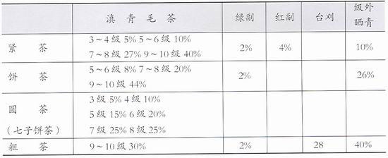
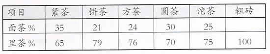

# 《普洱茶》陈香篇
### 邓时海(台湾师范大学教授、中国普洱茶学会会长、杨式太极拳第六代传人)
---
[返回首页](index.html)

### 前言 

这些年来生活品质已经大幅度提高，人们由温饱而讲究美食，更提升到艺术的境界。中国人日常生活中，开门七件事的柴、米、油、盐、酱、醋、茶，其中“茶”首先登上了艺术的殿堂。而且在中华文化领域中，占有一定的地位，茶文化是整体中华文化至为重要的一环。有人说中国茶文化历程，就是一部中华文化发展史。 

在数百种茶中，普洱茶是最能代表我国历史文化的产物。一是，普洱茶保有我国古代团茶古意盎然之美的形态。二是，普洱茶除了与一般茶叶重视原料、制作保存外，更讲究时间年代，具有历史价值意义。三是，普洱茶具有其：“越陈越香”独特的风味特色。四是，一旦喜欢上普洱茶，常常品尝，对其他茶汤会有难以入口接受之感。普洱茶真为茶中之茶，也中中国茶历史文化的代表。 

驱合普洱茶日益彰显崇高地位的诸多因素中，越陈越香是决定性条件。越陈越香的“香”字是广义性的，包括了普洱茶的茶韵、茶香、茶滋、茶气等整体风味。同是普洱茶品，而茶菁的老嫩等级，制作成生茶或熟茶，贮放在干仓或是湿仓，以及保存时间长短的不同，会形成各自独特的气韵和滋味，使普洱具有丰富而多变的特色。比如最幼嫩的蕊尖散茶与老粗的梗叶紧茶，经过长期的陈化，有着不同的品艺境。况且同样的一泡普洱茶，从头慢饮细品，前后沙发变化万千，使人着迷。 

近年来中国茶叶界，可以说是已经迈向复兴而开创的新时代，整个中国茶市场，茶文化都显得十分活跃。尤其借助新科学技术研究，有了极迅速发展进步，各类茶种的研究报告文章相继发表，资料日渐充实。但是，大多偏重在配合大众口味推广的资料，而有关普洱茶越陈越香独特风味的文字，很少出现，极可能越陈越香，会变成为普洱茶风味中的一个历史名词了！ 

茶叶在台湾地区已发展到非常成熟的境界，这种成熟境界现在也已感染了大陆。台湾茶的过去和成功路程，是大陆茶叶办一个极重要借鉴。乌龙茶登陋台湾百多年以来，发展出两种傲视全球的“文山包种”和“冻顶乌龙”。目前又在继续培育研制“高山茶”，也成效良好。台湾茶所以能发展如此成功，是社会消费形态给予的力量。一是当地政府提倡全民喝茶，二是品茗水准提升，在这两个条件完美结合之下，台湾产生了极其灿烂的中国茶文化。在仅仅两百万人的台北市，就有数百家卖茶叶的茶行，有近数百家品茗的茶艺馆，自然促进今天台湾茶的成功。 

大陆的茶文化，应该是正在由全民喝茶，而进入吕茗茶艺的阶段，因此各类茶种必须由普通的大众水平，提升到品茗的高境界。各种茶必须根据其独有特色，发挥其专长，表现其精粹。普洱茶也必然如此，而普洱茶所拥有的越陈超香独特条件，是有足够实力实力独步世界茶艺界的。

### 搜集及研究越陈越香

在海内外地区，有关普洱茶越陈越香的文字资料，几乎等于零。连中国土产畜产进口公司云南省茶叶分公司所出版《茶的故乡—云南》这册以介绍推广普洱茶为主的官方资料，也只提到“云南大叶种晒青毛茶经过后发酵特殊工艺精致而成，其外形条索粗壮肥大，色泽乌润或褐红，具有滋味醇厚回甘和独特的陈香，晒老少皆宜不可多得的保健饮料之一。……云南普洱茶有越陈越香品质越好的特点，可以长期保存饮用……”而已。此外，再也找不到比以上那些抽象文字，说明普洱茶越陈越香的更详细的资料了！形成普洱茶的，没有一个标准依据，只能像瞎子摸像各说各话了。虽然艺术的境界本来就是各说各话的，但必须要在一个共同的基础上着眼。目前普洱茶的市场太混乱，同时普洱茶本身的条件以及保存的变数太多，成为大家在杂乱的基础上，杂乱的各说各话。在这种恶性的循环之下，带给普洱茶的，将只是负面影响。要想正面提升普洱茶的境界，必须揭示出越陈越香的风味的科学依据，以使广大的普洱茶爱好者，得到一个品茗的基础条件，给制作生产普洱茶的单位，有改进提升技术的依据。

普洱茶原本是一种家族经营事业，就像法国酒一样，是“祖父做孙子卖”的传统工作，今天卖祖父辈做的茶，而现在做的茶将留给孙子们出售，自然随时可以看到越陈越香的产品和品尝到越陈越香的风味。今天在云南看到的、买到的普洱茶，极少有超过二十年以上的陈老普洱茶品，我们已经难以体会到什么是越陈越香了。20世纪30年代末，成立“中国茶叶公司”以来，香港商人向云南收购了很多普洱茶，一部分转售到海外（东南亚各地居多），大部分留存香港私人茶行。几年前，台湾茶叶界开始兴起喝普洱茶风气，香港商人从他们仓中，取出了陈年普洱茶卖到台湾。目前台湾有着许多普洱茶收藏者，拥有相当丰富的越陈越香的老普洱茶。希望在普洱茶原产地云南，成立类似“越陈越香专门单位”，向海内外搜集陈老的普洱茶，作研究探讨，或者与海内外普洱茶收藏者以及专家共同进行研究工作。否则，散落在各方硕果仅存的一些陈年普洱，一但被喝光或保存不当而腐败，克要再等上几十年后，才会有研究的素材。

### 制作级次纯正的普洱茶

滇菁毛茶在制成普洱茶之前，先分为十个级次(或分五级十等)从早期陈老的普洱茶可以发现，当时非常重视毛茶级次的拼配。比如制作沱茶的毛茶是用四级以前较嫩的；饼茶是以五级至八级中壮叶子制作；紧茶则以九、十级粗老的梗叶制成。不同老嫩级次的普洱，有着不同的气韵滋味特色．对一位品茗者来说，由级次比较单纯所制成的普洱茶，才能品到比较独特的气味正如吃大锅莱五味杂陈，那只适合狼吞虎咽而已，无从品味的。因此过去的陈老普洱茶，因在茶叶级次来说比较纯正，能完全发挥普洱茶老、中、嫩的品味特色。

20世纪60年代开始，因为“黄印昔洱园茶”的出现，影响了云南中茶牌公司所制普洱茶品，毛茶拼配处方有了很大的改变，就是各型普洱茶的荼菁级次合用得比较多。“各种茶按规定的原科拼配比例，出仓筛分。各重茶的原科拼配比例是：七子饼茶(园茶)原科为晒青3～8级，紧茶、饼茶、普洱方茶原科为晒青3～10级，紧茶再拼进一部分红茶副产品，以增加成品橙红的汤色。原料拼配比例一般不要更动，以保持产品品质稳定。”以下为云南各种普洱毛茶拼配比例表(《制茶学》，第204页——安徽省屯溪茶业学校主编，1979年6月)：

现在的普洱茶在每一种型茶中，除了拼配较多级次的毛茶外，为了表面好看，还分成面茶和里茶。在一饼茶中分两层，下层的由里茶做成，上层则用面茶铺上。面茶是以级次较嫩的滇青毛茶为原料，里茶是级次较老的滇青毛茶做成。云南普洱茶的面茶和里茶拼配比例如下(《制茶学》，第205页)：

从上面一些资料看到粗的茶砖，只用了九级和十级的毛茶，也不做面茶，这是根据过去老式的制作方法，但已掺有红、绿茶副产品在20世纪70年代中期，云南中茶公司曾制作一批较小，而蒸压较结实的砖茶，且印有7562字号，后来又制作了两批类似型的，一是由勐海茶厂生产的五块一包装；一是云南省农工商公司出品的四块一包装。这几批砖茶的拼配，已经打破粗砖的传统拼配，而用的原料约为三级到八级的毛茶，级次已很复杂了，目前云南普洱茶品中，只有部分的散茶、生沱，其滇青毛茶级次拼配比较单纯，其他大部分都是级次复杂或掺有其他类茶的混合性音洱茶了。

### 制作日凋生茶普洱茶

依据一般传统，对普洱茶品茗最高的要求条件，是以日凋的青饼，干仓保存为标准：因为在这些条件下所得到的品味，才被认为是普洱真正的“茶性”。在目前还没有研究出更具体、更科学的普洱茶品茗标准之前，茶艺品茗界多遵照这种传统方式来评鉴普洱茶的越陈越香。

经验告诉我们，各种普洱茶因制作的工序不同，结果会有着不同的品味，同样的滇青毛茶，可以制成品味较强的“阳刚性”的，也可以制造成品味较温和的“阴柔性”的普洱茶，但是，刚与柔两者之间，何者比较好，何者比较优，是没有一个正确答案的，因为个人的喜好并没有一定的标准。我们品茗界中,普洱茶的前辈们，约定俗成地有一个不成文的共识，普洱茶应“新鲜自然”为最上好。持着这个理念，他们在普洱茶制作工序上，提示了三个重点，那就是“日凋、生茶、干仓”。这三个工序重点就渐渐成为品茗普洱的指标，或作为评鉴普洱茶极重要的依据了。事实上，一般能依据以上三个重点制成的普洱茶，的确有比较“新鲜自然”的品味。

#### 日凋
陈老普洱茶的制作，在很早以前，云南的普洱茶厂大多是私人性质，规模也不大，特别讲究品质，茶菁萎凋大多数是采用日光萎凋。后来云南的茶山茶园收为国有，制作茶叶也集中由公家执行，为配合产量和不受气候影响，茶菁由过去多为日光萎凋，改为热风热气萎凋槽萎凋，以求达到经济及推广效益。经过现代科学的研究发现．日光萎凋和热风萎凋，对茶叶的品昧确实有不同的效果(《制茶学》，第83页)。而以日光萎凋最为新鲜，留给普洱茶一种别于热风萎凋的品味，品茗高手就把这种特殊品味，看成“新鲜”特色之一。但是．现在大部分的毛茶厂制作普洱茶，却是以热风萎凋为主，而且有完全取代日光萎凋的趋势(《中国茶经》，第212页，上海文化出版社，1992年5月)，甚为可惜。只有少部分兄弟民族私人做的滇青毛茶，采用炒青混合日光式萎凋，但已经为数不多了。

#### 生茶
过去私人制茶时代，都属于家族形态的经营．茶是祖传累积下来的，都是属于“做新茶卖旧茶”的交易，已超脱时间的因素。所以大多是做成青饼(采发酵过的青茶制成)的普洱生茶，留着将来子孙售卖，形成一种“陈旧循环”。现今云南普洱茶生产机构，是现代管理促销公司组织，井求快速获利．再加上品茗普洱者对越陈越香的理解，才正在酝酿而升，尚未形成大量需求。即使有一部分真正懂得品茗者，也因为留有少量已成为文化遗产的陈老昔洱，可以暂时满足他们一时的渴求。因此真正高水平的陈年普洱消费市场尚未形成，也难怪当今的普洱茶厂会以生产熟茶的普洱为主，以达到“当天出厂，立即销售，马上饮用”的大众化经济效益。普洱茶本是青茶后发酵茶种．以生茶贮放保存，即使上百年的陈茶都可以泡出新鲜感。做成熟饼(经过渥堆发酵的青茶制成)的普洱熟茶，甚至一出厂就可以冲泡饮用，但已经完全失尽普洱新鲜而有活性的魅力了。自从1973年昆明茶厂研究成功“渥堆发酵”工序以后，云南生产的普洱茶品，除了一部分有减肥功能的生沱和极少数的生茶七子饼外，主要是应付熟荼的消费市场，以“越熟越香”代替了越陈越香的品味，真是“一片熟气”了。

#### 干仓
普洱茶是属于后发酵茶，在后发酵过程中有两种现象，一是曲菌后发酵；一是无菌后发酵。有关后发酵的科学资料，日本学者研究得最多，要形成曲菌后发酵，必须要充足的水分或湿度。在普洱茶制作工序中的干燥程序，如果没有将普洱茶水分干燥到一定的程度，或者将普洱茶贮存在湿气很重的场所，都会引起曲菌生长，促成曲茵后发酵。如果在干燥程序中将茶中水分干透，同时贮存在湿度低，而未引起曲菌生长，是茶叶本身自己在继续发酵，称之为无菌后发酵。曲菌后发酵的普洱茶，俗称“湿仓普洱”；无菌后发酵的普洱茶，俗称“干仓普洱”。干仓普洱与湿仓普洱，有时可以从型茶表面就看出来。但是有些曾经在湿仓，后来改到干仓贮存，往往从表面上是不容易分辨出来，但可从冲泡后的叶底识别出来。曲菌后发酵的普洱茶经过了“霉变”，对普洱茶的真性有了极大影响。往往熟茶与湿仓茶，有着极相似的“失真”品味，也有较轻度的，短时间曲茵后发酵茶，经过三五开的冲泡后，可以还原到干仓普洱的特色。以目前的科技水平，要控制干仓的环境并不太困难，有好的干仓，才能贮存出来最自然美好的陈年普洱茶。

### 保留及栽培乔木茶树
“中庭院外，乔松修竹，间以茶树。树皆高三四艾，绝与桂树相似，时方采摘，无不架梯升树者。茶味颇佳，炒而后曝，不免黝黑”。明代大旅行家徐霞客，于崇祯十二年游云南感通寺，而作游记文章，说明了普洱茶是高大的乔木生长的。 

在品茗界有两个名词，一是“老树普洱”；一是“新树普洱”。普洱茶收藏者，都争先恐后地去搜集老树普洱茶茶。 “普洱茶是云南省南部的亚热带地方生长的大叶种，即乔禾型茶树的树叶制造，所以涩味比一般小叶种更强”(《中国茶艺入门》第42页，章学侬译)。云南的老茶树，不但树木高大，而树龄也长久。西双版纳州内，有高三十二米多，树龄一千七百多年的野生茶树；有高五米多，树龄八百多年人工栽培的茶树王。据说过去云南茶园，每株茶树都已经树龄很老，每过些年后，便将树干砍掉，树根重新再抽出新嫩树干如此树根越长而越深越广，所生长的茶叶品质越好。约在20世纪50年代末期开始，云南茶山进行矮化栽培，以配合经济效益。旧园老树茶叶产量少，而且采茶工作困难不方便。矮化的新树成灌木发展，根虽然浮浅，但可加人工肥料，茶叶量反而多，更可用机械统一作业。由以上粗浅的认识，便能了解到，为什么普洱茶收藏者，会不惜代价地去寻找老树普洱茶了。从思茅坐了五六小时车子到景洪，沿途看到的，是一片欣欣向荣的矮化新树普洱茶园。以我们目前品茗普洱茶的经验所及，新树普洱茶在越陈越香的效果上，是经不起考验的，并已背离越陈越香而远去了!此时此刻，老树普洱与新树普洱，应该是鱼与熊掌力求兼得才是。除了发展新树茶园之外，同时保留现有剩余的老茶树，以及规划栽种培育新的老茶树，才能延续中国茶文化的越陈越香的历史!

### 结语
在台湾有一句现代名言“今天不做，明天就会后悔”。将这句名言借用到这里，延续普洱茶越陈越香的生命，来挽回云南普洱茶的魅力，将普洱茶推向中国茶文化执牛耳地位，再恰当不过了!基于以上种种，在此迫切提出了以上浅见，以作为力行云南普洱茶越陈越香研究工作的参考。

明太祖从牛背上跳了下来，首先废了团茶，大家跟着他喝散茶，也确实做到了革新从简。可是从另一个角度看来，中国茶文化在唐宋的鼎盛，因而松散了下来。茶盅里倒满的，的确朴素清澈很多。然而，中国茶的躯体，赤裸裸地全部透明，更找不到丝毫叠着岁月的皱纹，缺少了团茶艺术生命。普洱茶品的越陈越香，是硕果仅存的，能教人自动翻阅历史，更能将历史文化滋养到现代人的肉体内。唐宋辉煌的茶事，随着陆羽的《茶经》，跨越了千百年时空之后，恐怕今天只能借着普洱茶越陈越香而再度发扬其精神，陆羽先生地下有灵，他老人家必会一则喜，一则憾。喜的是他一手采之、蒸之、捣之、拍之、焙之、穿之、封之，茶已干矣。现在总算有人起之、饮之、越陈越香之；遗憾的是他一手写的《茶经》，撰述了全国各地名茶，唯独漏列了最能继承他衣钵的云南普洱茶。如果我们仍然继续轻忽普洱茶珍贵的特色，总有一天，普洱茶的越陈越香，将永远成为历史的回响，能不让人扼腕乎!
