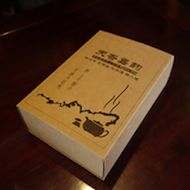
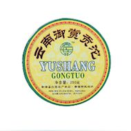
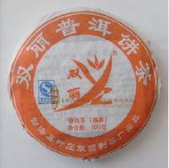
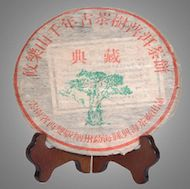

# 天香嘉韵

### 茶水纯正甘甜 身心舒畅宁静
---

## 觅佳茗-本站精心选茶，主营云南普洱 

|天香一号迷你沱|云南御赏贡沱（2007生沱）|双丽普洱饼茶(2008熟饼)|攸乐山典藏（2002熟饼）|
|:---------:|:---------:|:---------:|:---------:|
|||||
|[查看详细信息](http://item.taobao.com/item.htm?spm=0.0.0.0.HoEaIg&id=22013035718)|[查看详细信息](http://item.taobao.com/item.htm?spm=a1z10.1.w4004-2734769322.4.LKXuss&id=36666992194)|[查看详细信息](http://item.taobao.com/item.htm?spm=a1z10.1.w4004-2734769322.6.LKXuss&id=36653918779)|[查看详细信息](http://item.taobao.com/item.htm?spm=a1z10.1.w4004-2734769322.8.LKXuss&id=36657931359)|

---
## 论茶道-原来茶文化如此丰富有趣
* [品鉴普洱茶](品鉴普洱茶.html)

		 很多人初喝普洱茶，总有一点障碍。
		 障碍来自对比。最强大的对比者，是绿茶。
		 普洱茶没有明显的清香,却有一种陈旧的味道。
		 几杯上等的普洱茶入口，口感还说不明白呢，后背脊已经微微出汗了。随即腹中蠕动，胸间通畅，舌下生津。我在上文曾以“轻盈”二字来形容绿茶，而对普洱茶而言，则以自己不轻盈的外貌，换得了茶客身体的“轻盈”。

* [“茶为万病之药” 详解茶的11大养生保健功效](茶为万病之药.html)

	     喝茶不仅是消遣时的饮品，更是可以让人修身养性，长期喝茶可以延缓衰老，对于各种疾病也有预防的作用。唐代医药学家在《本草拾遗》中写道“茶为万病之药”。由此可见茶的神奇养生功效。
	     
* [普洱茶被称为生态茶的原因](普洱茶被称为生态茶的原因.html)
			
		 农药残留的问题对普洱茶而言并不容易发生。
		 古树茶、野生型茶树高大，无法以正常方式洒药，且大茶树洒农药、化肥容易死亡。云南茶区面积十分广阔，产量远多于目前的需要量，不需藉洒药增加产能。
		 2004年8月初，中国农业科学院茶叶研究所公布10个中国主要产茶省份茶叶抽检结果，云南省茶叶残留量最低。

* [奶茶和酥油茶的由来](奶茶和酥油茶的由来.html)

* [神农尝百草，日遇七十二毒，得茶而解之](神农尝百草.html)

* [茶与佛教](茶与佛教.html)

---
## 学冲泡
以下三招是我们总结的泡茶手法，简单实用、便于记忆。泡茶时可以根据茶叶性质和个人喜好选用其中的手法。

### 1.可圈可点
可圈可点在三招冲泡法中力度最轻。

手法：水沿着盖碗（或茶壶）边缘轻轻流入，同时使水沿着边缘旋转，水流带动茶叶在底部慢慢旋转，水满后轻轻收起，便完成可圈可点的动作了。

作用：转动茶叶使得茶叶受热均匀，同时因为力度不大，不会带出太多的苦涩味。

### 2.急流勇退
急流勇退在三招冲泡法中力度为中等。

手法：水沿着盖碗（或茶壶）边缘快速流入，同时使水沿着边缘旋转，水流带动茶叶在底部快速旋转，水满后马上收起，便完成急流勇退的动作了。

作用：转动茶叶使得茶叶受热均匀，稍大冲泡的力度使茶气更浓。

### 3.翻江倒海
翻江倒海在三招冲泡法中力度最重。

手法：水壶拿在较高的位置，对着盖碗（或茶壶）边缘垂直倒入水，使茶叶从底部向上翻转而浮到水面上，这就是翻江倒海手法。

作用：完全翻动茶叶使得茶叶大面积受到热水浸泡，快速出味。

---
© 2012 天香嘉韵.

